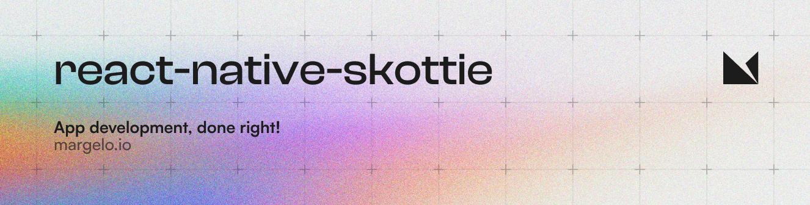
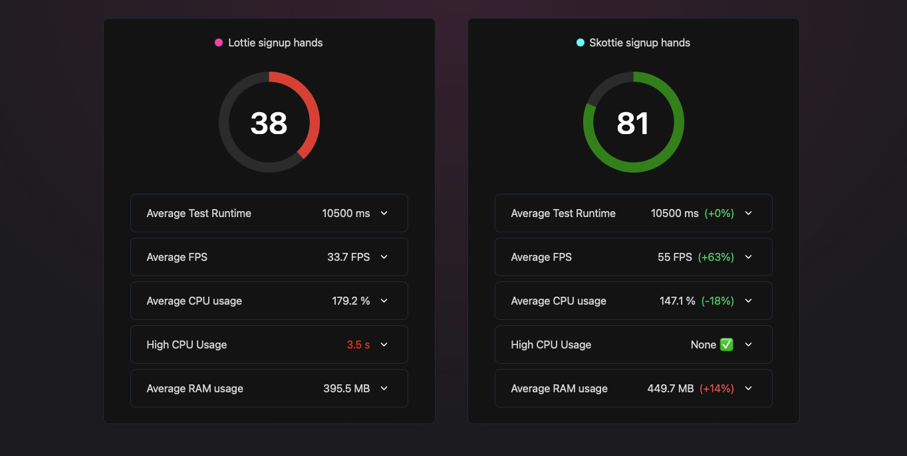

<a href="https://margelo.io">
  <picture>
    <source media="(prefers-color-scheme: dark)" srcset="./docs/bg-dark.png" />
    <source media="(prefers-color-scheme: light)" srcset="./docs/bg-light.png" />
    
  </picture>
</a>

### Features

[Skottie](https://skia.org/docs/user/modules/skottie/) is a high performance library for running [Lottie](https://airbnb.design/lottie/) animations in [Skia](https://skia.org).

- 📄 Supports Lottie files (JSON) and DotLottie files (.lottie)
- 📈 Uses Skia's GPU-acceleration
- 📉 Lower CPU usage
- 🏃 Higher frame rates
- 🔗 Based on [`@shopify/react-native-skia`](https://github.com/Shopify/react-native-skia)

### Benchmark

We benchmarked react-native-skottie against [lottie-react-native](https://github.com/lottie-react-native/lottie-react-native) on a low-end Android device running a complex animation and saw a +63% improvement in frame rates.



### Installation

> [!IMPORTANT]
> `react-native-skottie` depends on `@shopify/react-native-skia`, so make sure you install it first! (minimum required version: 0.1.228)

```sh
yarn add react-native-skottie
```

### Usage

```tsx
import { Skottie } from 'react-native-skottie';
// DotLottie files are supported as well!
import LottieAnimationFile from './animation.json';

export default function App() {
  return (
    <Skottie
      style={styles.flex1}
      source={LottieAnimationFile}
      autoPlay={true}
    />
  );
}
```

### Advanced usage

<details>
  <summary>Imperative ref API</summary>

```tsx
import { Skottie } from 'react-native-skottie';
import { Button } from 'react-native';

export default function App() {
  const skottieRef = useRef<SkottieViewRef>(null);

  return (
    <View>
      <Skottie
        ref={skottieRef}
        style={styles.flex1}
        source={LottieAnimationFile}
      />

      <Button
        title="Play"
        onPress={() => skottieRef.current?.play()}
      />
      <Button
        title="Pause"
        onPress={() => skottieRef.current?.pause()}
      />
      <Button
        title="Reset"
        onPress={() => skottieRef.current?.reset()}
      />
    </View>
  );
}

```

</details>

<details>
  <summary>Controlled by props</summary>

```tsx
import { Skottie } from 'react-native-skottie';
import { Button } from 'react-native';

export default function App() {
  const [isPlaying, setIsPlaying] = useState(false);

  return (
    <View>
      <Skottie
        autoPlay={isPlaying}
        style={styles.flex1}
        source={LottieAnimationFile}
      />

      <Button
        title="Play"
        onPress={() => setIsPlaying(true)}
      />
      <Button
        title="Pause"
        onPress={() => setIsPlaying(false)}
      />
    </View>
  );
}

```

</details>

<details>
  <summary>Controlled by reanimated</summary>

<br />
Note: React Natives Animated API is not supported yet.

```tsx
import { Skottie, SkottieAPI } from 'react-native-skottie';
import { useSharedValue, withTiming, Easing } from 'react-native-reanimated';

export default function App() {
  // A progress value from 0 to 1
  const progress = useSharedValue(0);

  // We need to run the animation on our own, therefor, we need to know the
  // animation's duration. We can either look that up from the lottie file,
  // or we can create the SkSkottie instance ourselves and get the duration:
  const skottieAnimation = useMemo(() => SkottieAPI.createFrom(lottieFile), []);
  const duration = skottieAnimation.duration;

  // Run the animation:
  useEffect(() => {
    // Will play the animation once …
    progress.value = withTiming(1, {
      duration: duration,
      easing: Easing.linear,
    });
    // … if you want to loop you could use withRepeat
  }, [duration]);

  return (
    <Skottie
      autoPlay={true}
      style={styles.flex1}
      source={LottieAnimationFile}
      // Pass the shared value to Skottie to drive the animation:
      progress={progress}
    />
  );
}

```

</details>

## API

`react-native-skottie` can be used as drop-in replacement for `lottie-react-native`, as it tries to support the same
props.
Note, not all props are supported yet. If you are missing a prop for your use-case please open an issue (and at best
also a PR 🤝):

### Props

| Prop name  | Type                                          | Default | Description                                                                                                                                                                                                         |
|------------|-----------------------------------------------|---------|---------------------------------------------------------------------------------------------------------------------------------------------------------------------------------------------------------------------|
| source     | `number \| string \| JSONObject \| SkSkottie` | -       | The source of the animation. Can be a JSON file or a DotLottie file. Playing from web URLs is not supported yet. You can also pass a SkSkottie instance on your own, see API.                                       |
| autoPlay   | `boolean`                                     | `false` | If true, the animation will start playing as soon as it is ready.                                                                                                                                                   |
| loop       | `boolean`                                     | `true`  | If true, the animation will loop.                                                                                                                                                                                   |
| progress   | `SharedValue<number>`                         | -       | A reanimated shared value from 0 to 1 that controls the progress of the animation. Note: if this is used neither the prop or imperative API will work, but you are responsible for controlling the animation state. |
| speed      | `number`                                      | `1`     | A value that controls the speed of the animation.                                                                                                                                                                   |
| style      | `ViewStyle`                                   | -       | The style of the animation.                                                                                                                                                                                         |
| resizeMode | `ResizeMode` `(cover, contain, fill)`         | `cover` | The resize mode of the animation.                                                                                                                                                                                   |

### Ref

`react-native-skottie` provides a ref API that allows you to control the animation imperatively. The ref is of type
`SkottieViewRef` and provides the following methods:

| Method name | Description                            |
|-------------|----------------------------------------|
| play        | Plays the animation.                   |
| pause       | Pauses the animation.                  |
| reset       | Resets the animation to the beginning. |

### SkottieAPI

`react-native-skottie` provides a SkottieAPI that allows you to create Skottie instances on your own. This is useful if
you want to control the animation with reanimated or if you want to know the duration of the animation before it is
played. The API is of type `SkottieAPI` and provides the following methods:

| Method name           | Description                                                          |
|-----------------------|----------------------------------------------------------------------|
| SkottieAPI.createFrom | Creates a Skottie instance from a source (string, json, file import) |

### Community Discord

[Join the Margelo Community Discord](https://discord.gg/6CSHz2qAvA) to chat about react-native-fast-tflite or other Margelo libraries.

### Adopting at scale

This library is provided _as is_.

If you stumble upon bugs or need help implementing react-native-skottie, reach out to us at https://margelo.io!

## Contributing

See the [contributing guide](CONTRIBUTING.md) to learn how to contribute to the repository and the development workflow.

## License

MIT

---

Made with [create-react-native-library](https://github.com/callstack/react-native-builder-bob)
