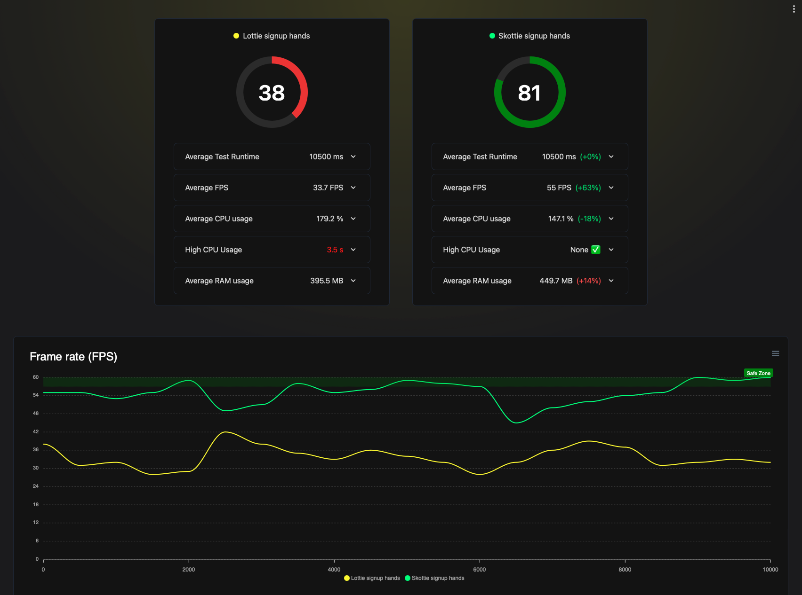

# ▶️🌠 react-native-skottie

Allows you to play lottie animations using the [Skottie module](https://skia.org/docs/user/modules/skottie/)
for [`@shopify/react-native-skia`](https://github.com/Shopify/react-native-skia).

## Highlights

- ▶️ Supports Lottie files (JSON) and DotLottie files (.lottie)
- 🤖 Especially for android it provides considerable performance gains:
  - 📈 Uses Skia's GPU accelerated rendering
  - 📉 Is less CPU intense than lottie-react-native
  - 🏃 Higher frame rates that lottie-react-native


> Performance comparison from testing a complex animation on a low end (Geekbench ~350) Android device.

## Installation

> [!IMPORTANT]
> `react-native-skottie` depends on `@shopify/react-native-skia`, so make sure you install it first! (minimum required
> version: 0.1.228)

```sh
npm install react-native-skottie
```

or

```sh
yarn add react-native-skottie
```

## Simple usage example

```tsx
import { Skottie } from 'react-native-skottie';
// DotLottie files are supported as well!
import LottieAnimationFile from './animation.json';

export default function App() {
  return (
    <Skottie style={styles.flex1} source={LottieAnimationFile} />
  );
}
```

## Other examples

<details>
  <summary>Imperative ref API</summary>

```tsx
import { Skottie } from 'react-native-skottie';
import { Button } from 'react-native';

export default function App() {
  const skottieRef = useRef<SkottieViewRef>(null);

  return (
    <View>
      <Skottie
        ref={skottieRef}
        style={styles.flex1}
        source={LottieAnimationFile}
      />

      <Button
        title="Play"
        onPress={() => skottieRef.current?.play()}
      />
      <Button
        title="Pause"
        onPress={() => skottieRef.current?.pause()}
      />
      <Button
        title="Reset"
        onPress={() => skottieRef.current?.reset()}
      />
    </View>
  );
}

```

</details>

<details>
  <summary>Controlled by props</summary>

```tsx
import { Skottie } from 'react-native-skottie';
import { Button } from 'react-native';

export default function App() {
  const [isPlaying, setIsPlaying] = useState(false);

  return (
    <View>
      <Skottie
        autoPlay={isPlaying}
        style={styles.flex1}
        source={LottieAnimationFile}
      />

      <Button
        title="Play"
        onPress={() => setIsPlaying(true)}
      />
      <Button
        title="Pause"
        onPress={() => setIsPlaying(false)}
      />
    </View>
  );
}

```

</details>

<details>
  <summary>Controlled by reanimated</summary>

Note: React Natives Animated API is not supported yet.

```tsx
import { Skottie, SkottieAPI } from 'react-native-skottie';
import { useSharedValue, withTiming, Easing } from 'react-native-reanimated';

export default function App() {
  // A progress value from 0 to 1
  const progress = useSharedValue(0);

  // We need to run the animation on our own, therefor, we need to know the
  // animation's duration. We can either look that up from the lottie file,
  // or we can create the SkSkottie instance ourselves and get the duration:
  const skottieAnimation = useMemo(() => SkottieAPI.createFrom(lottieFile), []);
  const duration = skottieAnimation.duration;

  // Run the animation:
  useEffect(() => {
    // Will play the animation once …
    progress.value = withTiming(1, {
      duration: duration,
      easing: Easing.linear,
    });
    // … if you want to loop you could use withRepeat
  }, [duration]);

  return (
    <Skottie
      autoPlay={true}
      style={styles.flex1}
      source={LottieAnimationFile}
      // Pass the shared value to Skottie to drive the animation:
      progress={progress}
    />
  );
}

```

</details>

## API

`react-native-skottie` can be used as drop-in replacement for `lottie-react-native`, as it tries to support the same
props.
Note, not all props are supported yet. If you are missing a prop for your use-case please open an issue (and at best
also a PR 🤝):

### Props

| Prop name  | Type                                          | Default | Description                                                                                                                                                                   |
|------------|-----------------------------------------------|---------|-------------------------------------------------------------------------------------------------------------------------------------------------------------------------------|
| source     | `number \| string \| JSONObject \| SkSkottie` | -       | The source of the animation. Can be a JSON file or a DotLottie file. Playing from web URLs is not supported yet. You can also pass a SkSkottie instance on your own, see API. |
| autoPlay   | `boolean`                                     | `false` | If true, the animation will start playing as soon as it is ready.                                                                                                             |
| loop       | `boolean`                                     | `true`  | If true, the animation will loop.                                                                                                                                             |
| progress   | `number`                                      | `0`     | A value from 0 to 1 that controls the progress of the animation.                                                                                                              |
| speed      | `number`                                      | `1`     | A value that controls the speed of the animation.                                                                                                                             |
| style      | `ViewStyle`                                   | -       | The style of the animation.                                                                                                                                                   |
| resizeMode | `ResizeMode`                                  | `cover` | The resize mode of the animation.                                                                                                                                             |

### Ref

`react-native-skottie` provides a ref API that allows you to control the animation imperatively. The ref is of type
`SkottieViewRef` and provides the following methods:

| Method name | Description                            |
|-------------|----------------------------------------|
| play        | Plays the animation.                   |
| pause       | Pauses the animation.                  |
| reset       | Resets the animation to the beginning. |

### SkottieAPI

`react-native-skottie` provides a SkottieAPI that allows you to create Skottie instances on your own. This is useful if
you want to control the animation with reanimated or if you want to know the duration of the animation before it is
played. The API is of type `SkottieAPI` and provides the following methods:

| Method name           | Description                                                          |
|-----------------------|----------------------------------------------------------------------|
| SkottieAPI.createFrom | Creates a Skottie instance from a source (string, json, file import) |

## Considerations

- Skottie has a higher memory usage than lottie-react-native or rive (but therefor might gives you better frames
  performance on low end devices.)
- Skottie depends on react-native-skia, which will increase your app size by a couple of megabytes (check their docs).
  However, in our test cases it didn't had a impact on app start time when using hermes.
- While skottie matches the UI frames performance on iOS it might uses more CPU than other alternatives. However, on
  Android it uses less CPU than lottie-react-native and gives you better frames performance.
- On iOS the react-native performance monitor or the XCode debugger may show a high memory usage. **This is
  a bug in the measurement of memory usage.** We are still investigating why it happens.
  <br />If you use XCode's memory profiler you will see that the memory usage is actually much lower than reported, same
  when testing with `mach_task_basic_info_data_t taskInfo`.

## Contributing

See the [contributing guide](CONTRIBUTING.md) to learn how to contribute to the repository and the development workflow.

## License

MIT

---

Made with [create-react-native-library](https://github.com/callstack/react-native-builder-bob)
